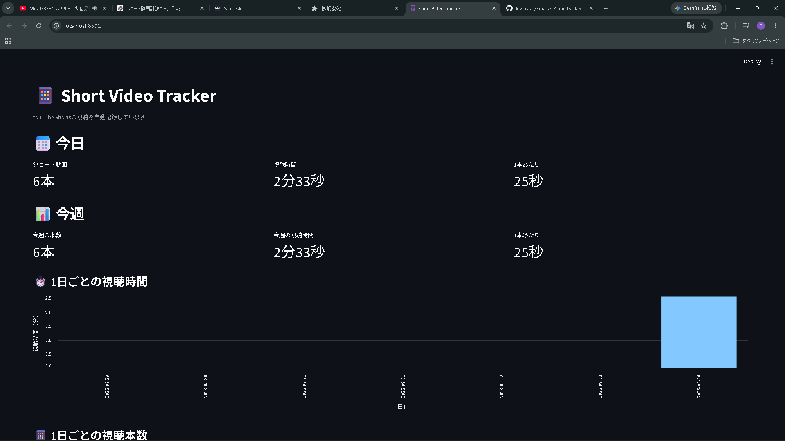

# YouTube Short Tracker

YouTube Shortsの視聴本数と視聴時間を自動で記録・可視化するツールです。

## 概要

YouTube Shortsを見ていると、気づかないうちに長時間見続けてしまうことがあります。

そこで、Chrome拡張機能を使ってYouTube Shortsの視聴を自動的に検出し、Pythonで視聴データを記録します。

記録したデータはStreamlitで作成したダッシュボードに表示し、1日の視聴本数・視聴時間や、過去7日間の視聴状況を確認できます。

手動で動画の本数や視聴時間を記録する必要はありません。

## 主な機能

* YouTube Shortsの視聴を自動検出
* 視聴本数を自動集計
* 視聴時間を自動記録
* 1本あたりの平均視聴時間を計算
* 過去7日間の視聴本数をグラフ表示
* 過去7日間の視聴時間をグラフ表示
* 視聴データを日付ごとに保存

## 使用技術

* JavaScript
* Python
* Flask
* Flask-CORS
* Streamlit
* Pandas
* Altair
* Chrome Extension

## システム構成

```text
YouTube Shorts
      ↓
Chrome Extension
      ↓
   JavaScript
      ↓
     Flask
      ↓
   data.json
      ↓
   Streamlit
      ↓
 ダッシュボード
```

### Chrome Extension

YouTube Shortsのページを監視し、動画IDや視聴時間を取得します。

取得したデータをPython側のFlaskサーバーへ送信します。

### Flask

Chrome拡張機能から送られてきた視聴データを受け取り、`data.json` に保存します。

### Streamlit

保存されたデータを読み込み、視聴本数・視聴時間・平均視聴時間・週間グラフなどを表示します。

## ダッシュボード


ダッシュボードでは以下の情報を確認できます。

* 今日のShorts視聴本数
* 今日の視聴時間
* 今日の1本あたりの平均視聴時間
* 今週の視聴本数
* 今週の視聴時間
* 1日ごとの視聴時間
* 1日ごとの視聴本数

## 開発目的

自分自身がYouTube Shortsにどの程度の時間を使っているのかを把握するために開発しました。

手動で記録するのではなく、Chrome拡張機能によって視聴データを自動的に取得することで、普段の利用状況を自然に可視化できるようにしました。

## 工夫した点

### 視聴時間の自動計測

動画を実際に視聴している時間をChrome拡張機能側で計測し、視聴時間として記録しています。

### 二重記録への対応

同じShortsについて複数回データが送信された場合でも、同じ動画の記録を更新することで視聴時間が重複して加算されないようにしています。

### データの可視化

単純に数字を表示するだけではなく、過去7日間の視聴状況をグラフ化することで、Shortsの利用状況を直感的に確認できるようにしています。

## 現在の状態

現在は自分のPC上で動作する形になっています。

```text
Chrome
  ↓
Chrome Extension
  ↓
自分のPC上のFlask
  ↓
data.json
  ↓
Streamlit
```

## 今後の予定

* Web上で誰でも利用できるようにする
* ユーザーごとのデータ管理
* データベースへの移行
* Chrome拡張機能を簡単にインストールできるようにする
* Webサービスとして公開する

## 開発環境

* Windows
* Visual Studio Code
* Google Chrome
* Python

## License

This project is for personal and educational purposes.
